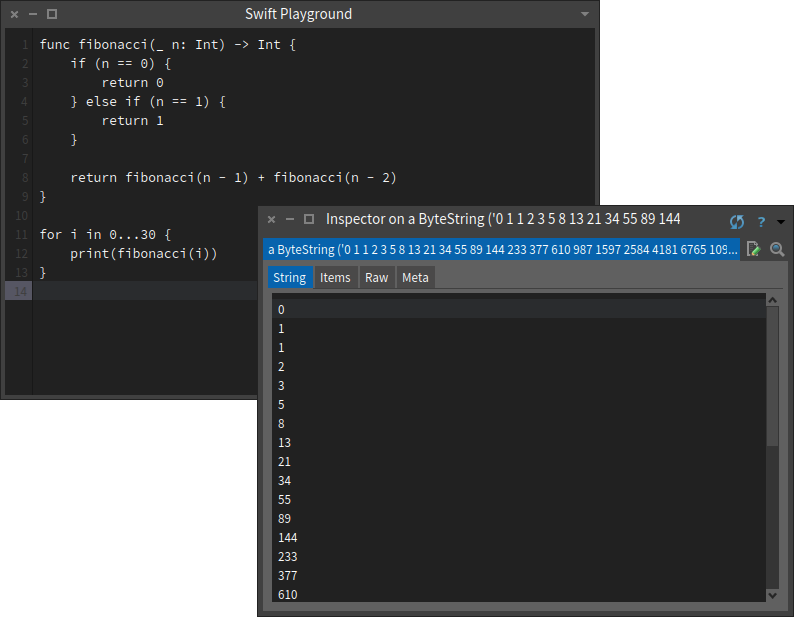

<p style="text-align: center;"><blockquote class="twitter-tweet" data-dnt="true"><p lang="en" dir="ltr">How to crash #Xcode 11: New -&gt; Playground -&gt; UIKit -&gt; Single View. Run.<br><br>I just remembered why I never use Xcode playgrounds.</p>&mdash; Ken Hates Software (@KenHatesSoftwar) <a href="https://twitter.com/KenHatesSoftwar/status/1296152018411651074?ref_src=twsrc%5Etfw">August 19, 2020</a></blockquote></p>

<p style="text-align: center;"><blockquote class="twitter-tweet"><p lang="en" dir="ltr">Now I get why Apple requires students to submit a playground that can be experienced in at most 3 minutes to apply for a WWDC scholarship… The reviewers have to spend the remaining 57 minutes trying to get Xcode to run it successfully 🤦</p>&mdash; Patrick Balestra (@BalestraPatrick) <a href="https://twitter.com/BalestraPatrick/status/1109932828970700802?ref_src=twsrc%5Etfw">March 24, 2019</a></blockquote></p>

<p style="text-align: center;"><blockquote class="twitter-tweet"><p lang="en" dir="ltr">Never ever praise an Xcode playground. It’s bound to crash 10 seconds later. #Swift #xcode #ios</p>&mdash; YOAD (@YOADAPPS) <a href="https://twitter.com/YOADAPPS/status/1075868207641231360?ref_src=twsrc%5Etfw">December 20, 2018</a></blockquote></p>

Because of Xcode [Swift](https://news.ycombinator.com/item?id=24473055) Playground [instability](https://twitter.com/search?q=xcode%20playground%20crash&f=live) while running even the [simplest](https://twitter.com/bioalex/status/1177368049873301506) of [Swift](https://news.ycombinator.com/item?id=24593628) code, this Swift code runner was implemented with Pharo. It brings the benefits of greatly increased stability for trying short pieces of code _and_  working with Swift output in the powerful Pharo live development environment. This is a work in progress.

- - -

SwiftPlayground-Pharo
===

**Interact with Swift on Pharo.**

Run Swift with the Pharo Swift Playground, interoperate with Pharo, inspect output and Swift [ASTs](https://en.wikipedia.org/wiki/Abstract_syntax_tree).

* [Pharo 8.0](https://www.pharo.org/) reference platform.
* Requires macOS (tested with 10.15.4) ***or*** GNU/Linux (tested with Ubuntu 14.04, 64 bit) ***and*** the Swift tools (see _Installation_).
  


## Table of Contents

* [Installation](#installation)
* [Usage](#usage)
* [API Reference](#api-reference)
  * [Swift Output and ASTs](#swift-output-and-asts)
  * [Pharo Object to Swift String Serialization](#pharo-object-to-swift-string-serialization)
  * [Swift Response String to Pharo Object Deserialization](#swift-response-string-to-pharo-object-deserialization)
  * [Imports](#imports)
  * [Asynchronous Swift Code](#asynchronous-swift-code)
* [TODO](#todo)
* [Acknowledgements](#acknowledgements)
* [Author](#author)
* [License](#license)

## Installation

1. Install and setup the Swift tools for your environment:
    * **macOS:** Install the [Command Line Tools for Xcode](https://developer.apple.com/download/more/?=command%20line%20tools).
    * **GNU/Linux:** [Install Swift](https://www.swift.org/getting-started/#installing-swift) from [swift.org](https://www.swift.org/).
2. In a Playground, _Do it_:

    ```smalltalk
    Metacello new
      repository: 'github://brackendev/SwiftPlayground-Pharo';
      baseline: 'SwiftPlayground';
      onConflict: [ :ex | ex useIncoming ];
      onUpgrade: [ :ex | ex useIncoming ];
      onDowngrade: [ :ex | ex useLoaded ];
      ignoreImage;
      load.
    ```

## Usage

### SWIFT PLAYGROUND

Write, compile, run, and inspect output of Swift code via the Swift Playground (accessible via the Tools menu).


##### Important contextual menu items:

* `Do it` – Compile and run the selected Swift code
* `Inspect it` – Compile and run the selected Swift code, inspect it
* `Print it` – Compile and run the selected Swift code, print it (**TODO**)

Additionally, the contextual menu item, `Inspect AST`, returns the Swift [AST](https://en.wikipedia.org/wiki/Abstract_syntax_tree) for the selected Swift code. For example, `print("Hello, World!")` returns:

```
(import_decl range=[Swift:1:1 - line:1:8] 'Foundation')
  (top_level_code_decl range=[Swift:2:1 - line:2:22]
    (brace_stmt range=[Swift:2:1 - line:2:22]
      (call_expr type='<null>' arg_labels=_:
        (unresolved_decl_ref_expr type='<null>' name=print function_ref=unapplied)
        (paren_expr type='<null>'
          (string_literal_expr type='<null>' encoding=utf8 value="Hello, World!" builtin_initializer=**NULL** initializer=**NULL**)))))
```

### INLINE SWIFT

Outside of the Swift Playground, Swift code can be executed within Pharo code by using the `runSwift` string class extension. For example:


## API Reference

### SWIFT OUTPUT AND ABSTRACT SYNTAX TREES

Pharo class extension methods can be used to compile, run, and view the [AST](https://en.wikipedia.org/wiki/Abstract_syntax_tree) of Swift code.

#### ◼︎ String class extension: `runSwift`

Returns a string representation of a Swift object from Swift code. Use Swift's [print](https://developer.apple.com/documentation/swift/1541053-print) function within the Swift code for output to Pharo. For example:
	
```smalltalk
swiftString := 'The five boxing wizards jump quickly' asLowercase asSwiftString.
('let (lowercased, alphabet) = (Set(', swiftString, '), "abcdefghijklmnopqrstuvwxyz")
print("\(!alphabet.contains { !lowercased.contains($0) })")') runSwift.
```

_returns_ `true`

Tip: Simple Swift code does not require Swift's [print](https://developer.apple.com/documentation/swift/1541053-print) function. For example:

```smalltalk
'Array("ABCDE")' runSwift.
```

_returns_ `'["A", "B", "C", "D", "E"]'`

```smalltalk
swiftArray := #(1 2 3 4 5) asSwiftArray.
(swiftArray, '.map{$0 * $0}.reduce(0, +)') runSwift.
```

_returns_ `'55'`

#### ◼︎ String class extension: `swiftAST`

Returns the Swift [AST](https://en.wikipedia.org/wiki/Abstract_syntax_tree) of Swift code.

### PHARO OBJECT TO SWIFT STRING SERIALIZATION

Pharo class extension methods can be used as quick helpers to serialize Pharo objects to Swift psuedo-objects (Pharo strings representing Swift objects). For example, `'Hello, World!' asSwiftString` returns `'"Hello, World!"'`.

These are useful in concatenating Pharo strings of Swift code. For example, in the code below, notice the usage of `sentence` and `asSwiftString` and how they're used in the `swiftCode` string concatenation:

```smalltalk
sentence := 'The five boxing wizards jump quickly' asLowercase asSwiftString.

swiftCode := ('
// Determine a pangram
let (sentenceSet, alphabet) = (Set(', sentence, '), "abcdefghijklmnopqrstuvwxyz")
print(!alphabet.contains {
  !sentenceSet.contains($0)
})
').

swiftCode runSwift.
```

_returns_ `'true'`

Currently, the following extension methods have been implemented. The examples are also availabe via the `SPExamples` object.

#### ◼︎ Array class extension: `asSwiftArray`

Currently only handles one depth of booleans, numbers, and strings.

```smalltalk
#(1 'A' 2 true 3 false) asSwiftArray.
```

_returns_ `'[1,"A",2,true,3,false]'`

#### ◼︎ Boolean class extension: `asSwiftBoolean`

```smalltalk
true asSwiftBoolean.
```

_returns_ `'true'`

#### ◼︎ Dictionary class extension: `asSwiftDictionary`

Currently only handles one depth of booleans, numbers, and strings.

```smalltalk
(Dictionary newFrom: {(1 -> 2). ('A' -> 3). (4 -> 'B'). (5 -> true).
(false -> 'C'). ('D' -> 'E')})  asSwiftDictionary.
```

_returns_ `'[1:2,"A":3,4:"B",5:true,"D":"E",false:"C"]'`

#### ◼︎ String class extension: `asSwiftString`

```smalltalk
'Hello, World!' asSwiftString.
```

_returns_ `'"Hello, World!"'`

### SWIFT RESPONSE STRING TO PHARO OBJECT DESERIALIZATION

**(TODO)**

### IMPORTS

The Apple [Foundation](https://developer.apple.com/documentation/foundation) framework is imported into Swift code automatically. To use other Apple frameworks with Swift code, use the Swift `import` directive.

### ASYNCHRONOUS SWIFT CODE

To prevent asynchronous Swift code from exiting too early, use the Swift [dispatchMain()](https://developer.apple.com/documentation/dispatch/1452860-dispatchmain) function to never return and use the Swift [exit()](https://developer.apple.com/documentation/foundation/thread/1409404-exit) function to exit where appropriate.

For example, in the Swift code below, a Swift [URLRequest](https://developer.apple.com/documentation/foundation/urlrequest) network request session is started and `dispatchMain()` is called so the program does not prematurely exit. In the session response closure, `exit(0)` is then called to exit the program.

```swift
let sessionConfig = URLSessionConfiguration.default
let session = URLSession(configuration: sessionConfig, delegate: nil, delegateQueue: nil)

var url = URL(string: "https://www.gravatar.com/4f64c9f81bb0d4ee969aaf7b4a5a6f40.json")
var request = URLRequest(url: url!)
request.httpMethod = "GET"

let task = session.dataTask(with: request, completionHandler: { data, response, error in
    if let uError = error {
        print(uError.localizedDescription) // Returns error string
    } else if let uData = data, let string = String(data: uData, encoding: String.Encoding.utf8) {
        print(string) // Returns response string
    }
    exit(0) // Exit after asynchronous work is complete
})
task.resume()

session.finishTasksAndInvalidate()
dispatchMain() // Prevent premature exit
```

## TODO

- [ ] Swift Playground: `Print it`
- [ ] Swift Playground: Syntax highlighting and code completion
- [ ] Swift Playground: Open/save files
- [ ] Swift response string to Pharo object deserialization
- [ ] Move documentation to the wiki
- [ ] Move to [Spec2](https://astares.blogspot.com/2019/08/spec2.html)

## Acknowledgements

This project makes use of the following third-party library:

* [OSSubprocess](https://github.com/pharo-contributions/OSSubprocess)

## Author

[brackendev](https://www.github.com/brackendev)

## License

SwiftPlayground-Pharo is released under the MIT license. See the LICENSE file for more info.

- - -

## Useful Links

* [@pharoproject](https://twitter.com/pharoproject) [Twitter]
* [@swiftlang](https://twitter.com/SwiftLang) [Twitter]
* [pharo.org](https://www.pharo.org/)
* [swift.org](https://www.swift.org/)
